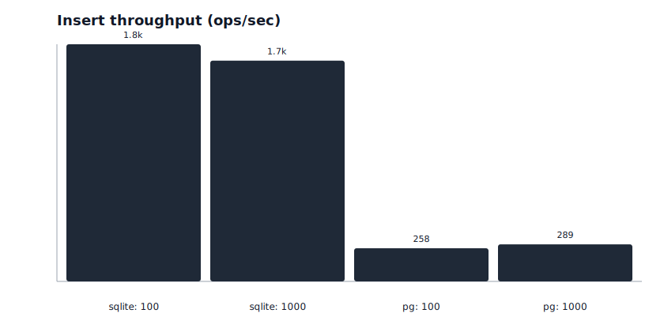
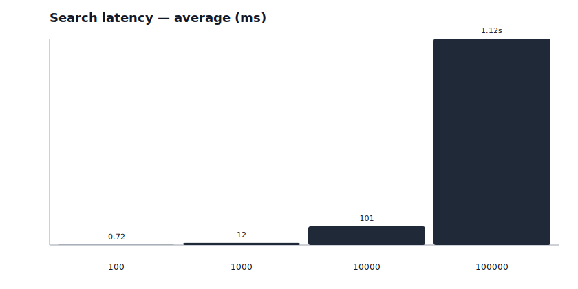
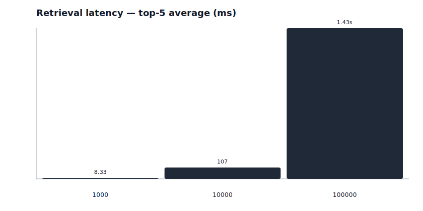
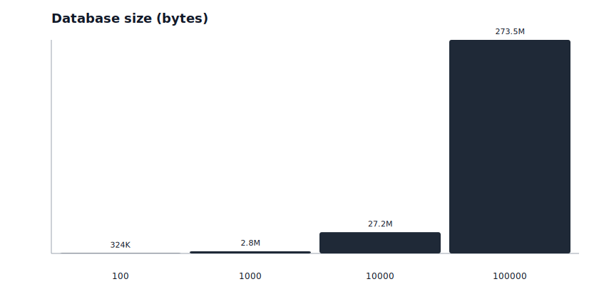
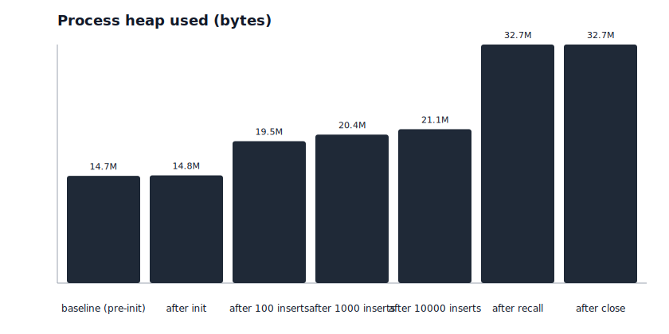
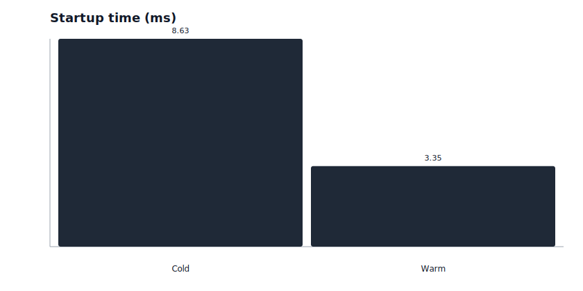
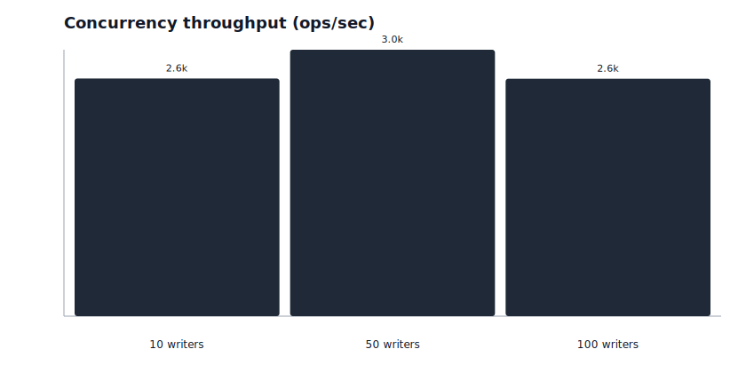
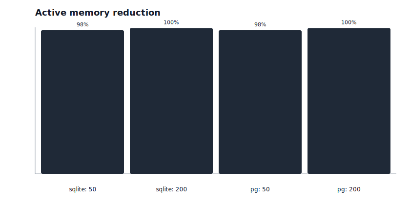

# Wolbarg Benchmarks

Public, reproducible benchmarks for **[wolbarg](https://www.npmjs.com/package/wolbarg)** — local-first semantic memory for AI agents.

- **Website:** [wolbarg.com/benchmarks](https://wolbarg.com/benchmarks)
- **SDK:** [github.com/Atharvmunde11/wolbarg](https://github.com/Atharvmunde11/wolbarg) · [npm `wolbarg`](https://www.npmjs.com/package/wolbarg)
- **Docs:** [wolbarg.com](https://wolbarg.com)

These benchmarks measure the **complete Wolbarg SDK** (storage + recall path), not raw SQLite or PostgreSQL alone.

**Published run:** suite **v2.0.0** · **wolbarg@0.3.0** · dual-backend **SQLite + PostgreSQL** · mode `mock` · scale `quick` · generated **2026-07-15**.

```bash
npm install
npm run benchmark
```

## Headline numbers (2026-07-15)

| Metric | Result |
| --- | --- |
| SQLite cold start | 7.91 ms |
| SQLite search @ 1k | 2.02 ms |
| SQLite insert @ 1k | 1.72k ops/sec |
| Postgres 16 writers | 1.12k ops/sec |
| Postgres search @ 1k | 4.70 ms |

> **Storage suite = mock embeddings.** Numbers above come from the dual-backend mock suite (local OpenAI-compatible mock server). A separate **LIVE** spot suite measures real-provider network latency and is not mixed into these headline figures.

Full charts and commentary: [wolbarg.com/benchmarks](https://wolbarg.com/benchmarks)

## Environment

| Key | Value |
| --- | --- |
| Node | v24.13.1 |
| Platform | win32/arm64 |
| CPUs | 8 |
| Host RAM | 15.61 GB |
| SDK | wolbarg@0.3.0 |
| Suite | v2.0.0 |
| Mode | mock |
| Scale | quick |
| Backends | sqlite, postgres |
| Generated | 2026-07-15T13:59:16.872Z |

## Summary

| Benchmark | Dataset | Backend | Result |
| --- | --- | --- | --- |
| Startup | Cold | sqlite | 7.91 ms |
| Startup | Warm | sqlite | 4.33 ms |
| Compression | 50 | sqlite | 98.00% |
| Compression | 200 | sqlite | 99.50% |
| Concurrency | 2 writers | sqlite | 1.70k ops/sec |
| Concurrency | 4 writers | sqlite | 1.60k ops/sec |
| Concurrency | 8 writers | sqlite | 1.58k ops/sec |
| Concurrency | 16 writers | sqlite | 907.05 ops/sec |
| Search | 100 | sqlite | 893.1 µs |
| Search | 1000 | sqlite | 2.02 ms |
| Insert | 100 | sqlite | 1.85k ops/sec |
| Insert | 1000 | sqlite | 1.72k ops/sec |
| Startup | Cold | postgres | 52.95 ms |
| Startup | Warm | postgres | 63.64 ms |
| Concurrency | 2 writers | postgres | 295.88 ops/sec |
| Concurrency | 4 writers | postgres | 438.97 ops/sec |
| Concurrency | 8 writers | postgres | 554.12 ops/sec |
| Concurrency | 16 writers | postgres | 1.12k ops/sec |
| Search | 100 | postgres | 5.97 ms |
| Search | 1000 | postgres | 4.70 ms |
| Insert | 100 | postgres | 258.16 ops/sec |
| Insert | 1000 | postgres | 288.52 ops/sec |

See [`results/SUMMARY.md`](results/SUMMARY.md) for the full summary table, and [`results/benchmark.md`](results/benchmark.md) / [`results/Benchmarks.md`](results/Benchmarks.md) for methodology detail.

## Performance Charts

### Insert Throughput



### Search Latency



### Retrieval Latency



### Database Size



### Memory Usage



### Startup Time



### Concurrency Throughput



### Compression Ratio



## Methodology

Every suite answers three questions in plain English:

1. **What is being measured?**
2. **Why does it matter?**
3. **How was it measured?**

Full write-ups live in [`results/benchmark.md`](results/benchmark.md).

### Active memory reduction (compression)

Compression shrinks the **active working set**.

- Archived memories **remain on disk**
- Storage size does **not** shrink
- Only active working memory is reduced

### Modes

| Mode | Command | Use when |
| --- | --- | --- |
| Mock (default) | `npm run benchmark` | Reproduce SDK storage numbers without API cost |
| Live | `npm run benchmark:live` | Measure with your own embedding/LLM keys |
| Quick | `npm run benchmark:quick` | Smaller datasets for CI / smoke tests |

**Storage adapter coverage:** SQLite **and** PostgreSQL (dual-backend suite v2.0.0).

## How to compare tools

Feature comparison only — **no invented speed numbers**.

**Legend:** ✓ Supported · ◐ Partial · ✗ No · — Unknown

| Feature | Wolbarg | Chroma | Qdrant | LanceDB | Mem0 |
| --- | --- | --- | --- | --- | --- |
| SQLite-based | ✓ | ◐ | ✗ | ✗ | ◐ |
| Local-first | ✓ | ✓ | ◐ | ✓ | ◐ |
| Framework Agnostic | ✓ | ✓ | ✓ | ✓ | ✓ |
| Model Agnostic | ✓ | ✓ | ✓ | ✓ | ✓ |
| Memory Compression | ✓ | — | ✗ | — | ✓ |
| Semantic Search | ✓ | ✓ | ✓ | ✓ | ✓ |
| Hybrid Search | ✓ | ◐ | ✓ | ✓ | ◐ |
| Open Source | ✓ | ✓ | ✓ | ✓ | ✓ |
| Runs Offline | ✓ | ✓ | ✓ | ✓ | ◐ |
| Storage Adapter | ✓ | ✓ | ◐ | ◐ | ✓ |
| Provider Adapter | ✓ | ✓ | ✓ | ✓ | ✓ |
| Public Benchmark Repo | ✓ | — | — | — | — |

Based on public documentation only. See [`comparison/features.ts`](comparison/features.ts) for notes.

Website: [wolbarg.com/benchmarks](https://wolbarg.com/benchmarks) · npm: [`wolbarg`](https://www.npmjs.com/package/wolbarg)

## How to reproduce

```bash
git clone https://github.com/Atharvmunde11/wolbarg-benchmarks.git
cd wolbarg-benchmarks
npm install
npm run benchmark        # full suite
npm run charts           # regenerate charts from results/benchmark.json
```

Requires **Node.js 22.5+**.

Detailed JSON: [`results/benchmark.json`](results/benchmark.json)

## How to contribute

See [CONTRIBUTING.md](CONTRIBUTING.md).

## License

MIT
